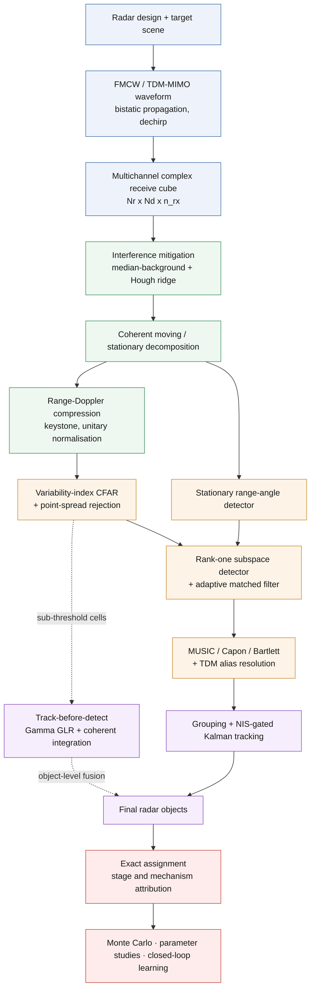
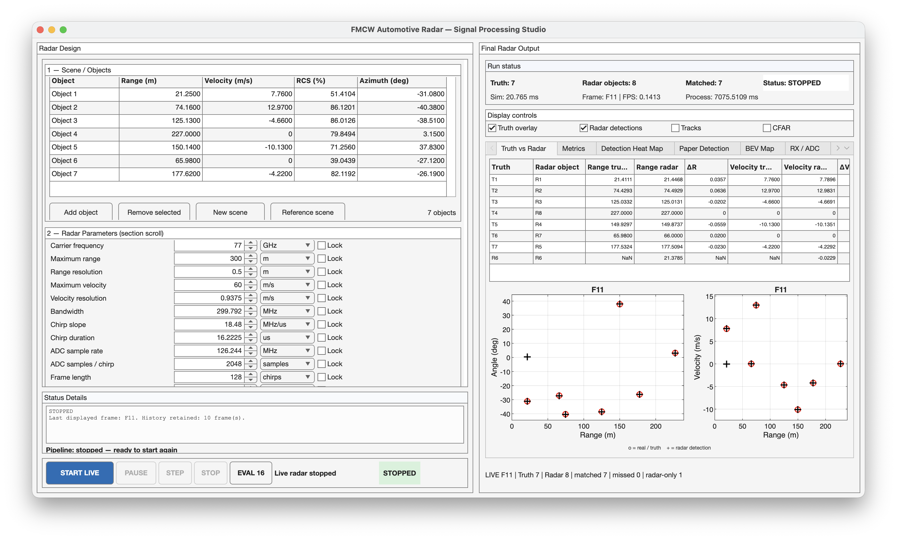
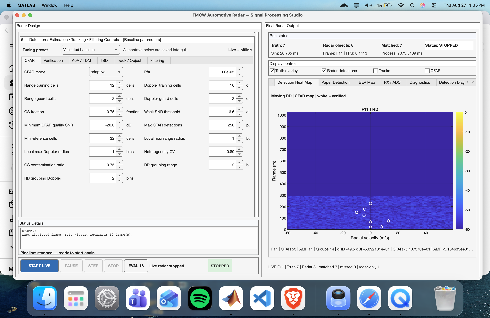
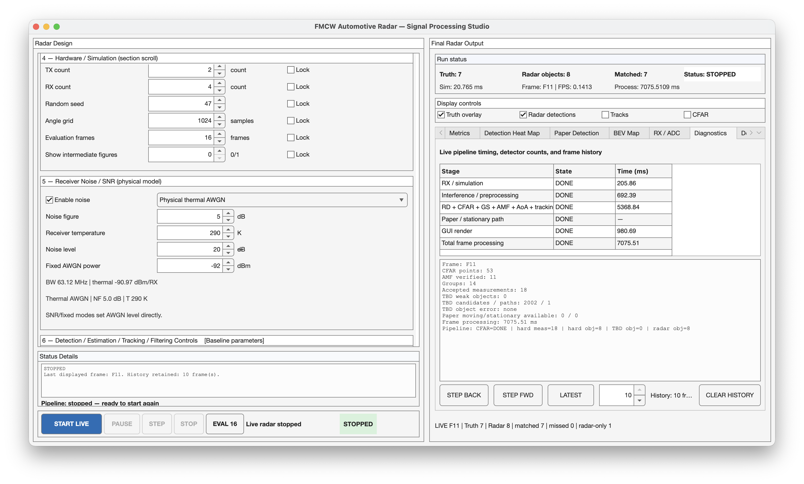
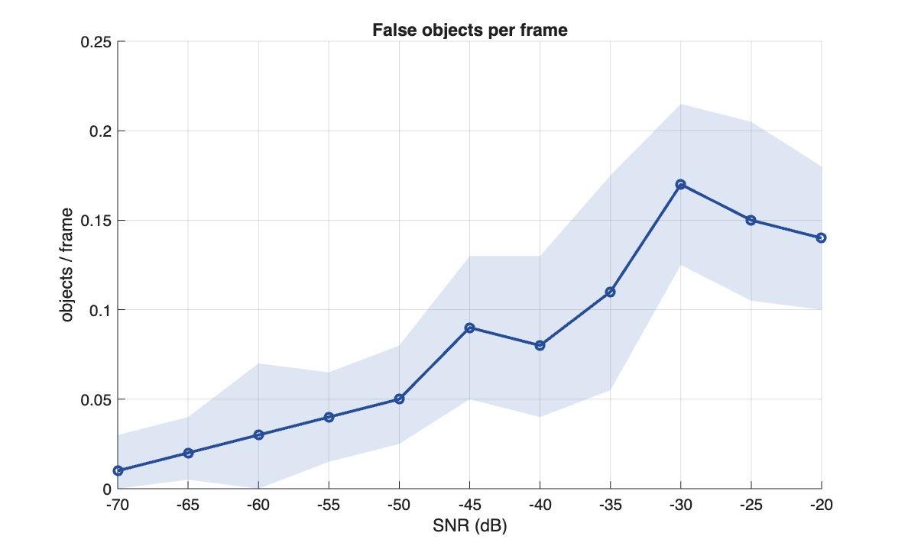
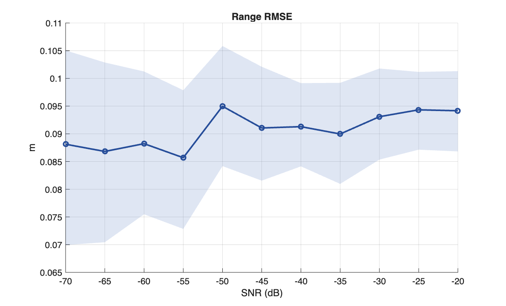
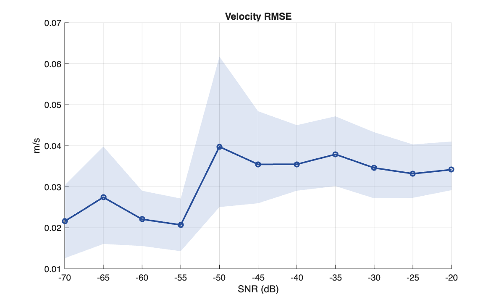
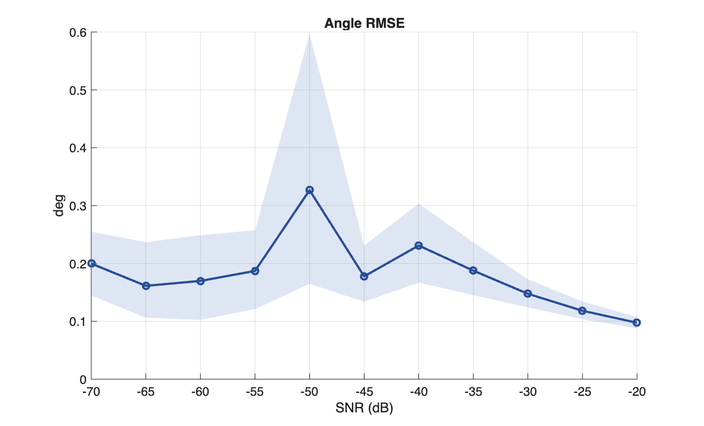
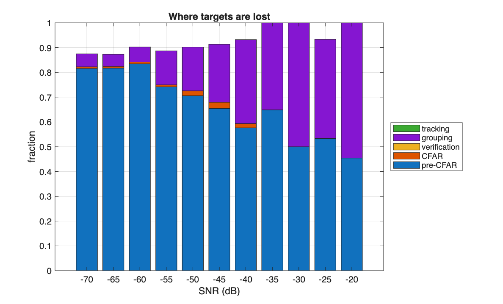
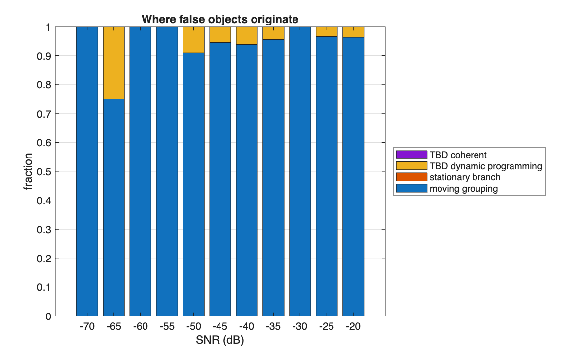

# FMCW / TDM-MIMO Automotive Radar — Simulation & Perception Framework

**A complete 77 GHz automotive radar in MATLAB: coupled waveform design, bistatic multichannel propagation, dechirped complex-baseband receive modelling, mutual-interference mitigation, Gamma-calibrated CFAR detection, adaptive matched-filter and rank-one subspace verification, MUSIC/Capon/Bartlett angle estimation on a physical TDM virtual aperture, joint Doppler-ambiguity resolution, dual-branch track-before-detect, NIS-gated Kalman tracking with evidence-graded object formation, exact-assignment evaluation with per-stage miss attribution, a Monte Carlo campaign engine with paired seeds and Wilson/bootstrap intervals, a bounded closed-loop parameter learner, and an interactive design and diagnostics application.**

---

## Overview

The framework takes a parameterised 77 GHz radar and a configurable multi-target scene and carries a signal through the entire chain. It begins with multichannel waveform synthesis and bistatic propagation, dechirping and range-Doppler compression, mutual-interference and clutter mitigation, and constant false-alarm-rate detection whose multipliers are solved numerically against the assumed Gamma null. From there it continues into matched-filter and rank-one subspace verification, MUSIC-based angle estimation with explicit TDM velocity-ambiguity resolution, two independent track-before-detect branches for sub-threshold targets, and Kalman-filtered multi-object tracking with duplicate suppression and evidence-gated promotion. It ends in an evaluation layer that scores the result against truth and attributes every miss to the stage that lost it and every false object to the mechanism that produced it.

Wrapped around that pipeline is a full experimentation layer. A Monte Carlo engine reports Wilson-score and bootstrap confidence intervals over randomised scenes with seeds paired across conditions, accumulating sectioned runs into a resumable store. A generalised parameter-sweep framework offers single-field sweeps, two-field response surfaces, cached stagewise replay and a sensitivity ranking that identifies which parameters move the operating point before any tuning starts. A bounded PID-style learner tunes detection and tracking thresholds under a lexicographic objective and validates on a held-out split. A validation suite checks the physics numerically, the statistics empirically, and the package structurally.

**An interactive application drives the same pipeline and the same configuration objects the offline scripts use.** The radar itself is editable from the interface — carrier, maximum range, range and velocity resolution, bandwidth, chirp slope and duration, ADC rate, samples per chirp, frame length, azimuth span, transmit and receive counts — with unit selectors, individual lock controls, and a live panel of derived quantities that flags a physically impossible design before a run rather than after it. The target scene is editable target by target in range, velocity, cross-section and azimuth. Six further tabs expose essentially every numeric field the detection, estimation, weak-target and tracking stages read: CFAR mode and false-alarm probability with its training and guard geometry, matched-filter and subspace thresholds, MUSIC grid and model order, TDM alias span and coherence weighting, both weak-target branches' path-quality gates, and the tracker's confirmation and object-existence gates. Every control binds to a parameter the pipeline actually reads, and each opens on the value the model will use, so a tuned operating point appears in the interface after a restart. Nine result views cover truth-versus-radar object comparison with per-object error, range-angle and range-velocity displays, the moving-target detection map, the moving and stationary maps side by side, a bird's-eye object map, the simulated dechirped waveform and its beat spectrum, per-stage pipeline timing, and detection attribution — with frame history that steps backward and forward through stored frames, redrawing every view from the stored snapshot.

Every stage operates on physically derived quantities. Range comes from a calibrated beat-frequency relationship. CFAR multipliers solve the exact false-alarm integral rather than a large-sample approximation. Angle comes from subspace estimation on a virtual aperture built from real transmit and receive coordinates, and the angular resolution that sets the tracker's duplicate gates is derived from that aperture rather than assumed. TDM velocity ambiguity is resolved by reconstructing the aperture under competing alias hypotheses and scoring their spatial and temporal coherence. Object promotion requires evidence to accumulate across several independent axes — CFAR statistics, matched-filter score, angular consistency, temporal persistence — and none of it touches the truth table, which is reserved for scoring the output afterwards.

| | |
|---|---|
| **Environment** | MATLAB R2019b or later, base installation, no toolbox dependency |
| **Subsystems** | config · simulation · processing · interference · detection · estimation · tbd · tracking · evaluation · experiments · gui · validation |
| **Detection** | Gamma-calibrated CFAR (CA/OS/GO/SO, variability-index selection), point-spread rejection, adaptive matched filter, rank-one subspace detector, independent stationary detector |
| **Estimation** | MUSIC, Capon and Bartlett with MDL model-order selection on a physical TDM virtual aperture; joint spatial and slow-time-coherence alias resolution |
| **Weak targets** | Gamma-GLR dynamic-programming search and motion-compensated coherent integration, both angularly verified |
| **Tracking** | Constant-velocity Kalman with chi-squared NIS gating, circular bearing filter, four evidence-graded promotion routes |
| **Evaluation** | Exact cardinality-first assignment, per-stage miss attribution, per-mechanism false-object classification |
| **Experiments** | Randomised-scene Monte Carlo with paired seeds and a resumable store; parameter sweeps, response surfaces, sensitivity ranking; bounded closed-loop threshold learning under held-out validation |
| **Interface** | Interactive application for editing the radar design and the target scene, exposing every tunable stage parameter, with nine result views, per-stage timing, detection attribution and frame-history stepping; plus a causal real-time execution mode |
| **Validation** | Nine behavioural and structural suites, plus a three-part empirical false-alarm study |

### Derived operating point

Four design choices — carrier, range resolution, velocity design point and velocity resolution — determine everything below through coupled radar relationships. Change one and the rest follow.

| Quantity | Value | Origin |
|---|---|---|
| Carrier / wavelength | 77 GHz / 3.893 mm | design input |
| Sweep bandwidth | 299.79 MHz | `B = c / 2ΔR` |
| Chirp duration | 16.223 µs | `T = λ / 4·v_max` |
| Chirp slope | 18.48 THz·s⁻¹ | `S = B / T` |
| Fast × slow time | 2048 × 128 samples | ADC floor, `λ / 2ΔvT` |
| ADC sample rate | 126.24 MHz | 3.4× maximum beat frequency |
| Range resolution | 0.500 m | `c / 2B` |
| Velocity resolution | 0.9375 m·s⁻¹ | `λ / 2·Nd·T` |
| Unambiguous velocity | ±60 m·s⁻¹ chirp-to-chirp, **±30 m·s⁻¹ same-TX** | narrows by `n_tx` |
| Array | 2 TX × 4 RX → 8-element virtual aperture, 3.50 λ | physical phase centres |
| Angular resolution | **14.50°** half-power beamwidth | `0.886·λ / L` |
| Frame interval | 2.076 ms | `Nd · T_chirp` |
| Receiver noise | −88.3 dBm per chain | `kTBF`, band-limited to the IF passband |
| Coherent processing gain | **+56.7 dB** | `Nr·Nd`, four chains, window loss |

The last row is the reason the SNR axis in [§14](#14-results) runs from −70 dB: the figure set in configuration is per ADC sample, before the transform chain applies its gain.

---

## Measured performance

A held-out Monte Carlo campaign of **275 trials across 11 signal-to-noise conditions**, eight frames per trial, randomised scenes with seeds paired across conditions:

| SNR (dB) | `Pd` | 95 % Wilson CI | Frame-level `Pd` | False objects / frame | Dominant miss stage |
|---:|---:|---|---:|---:|---|
| −70 | 0.141 | [0.098, 0.200] | 0.165 | 0.010 | pre-CFAR 82 % |
| −60 | 0.249 | [0.191, 0.317] | 0.266 | 0.030 | pre-CFAR 84 % |
| −50 | 0.424 | [0.353, 0.497] | 0.473 | 0.050 | pre-CFAR 71 % |
| −45 | 0.542 | [0.469, 0.614] | 0.607 | 0.090 | pre-CFAR 65 % |
| −40 | 0.667 | [0.594, 0.732] | 0.705 | 0.080 | pre-CFAR 58 % |
| −35 | 0.791 | [0.725, 0.844] | 0.827 | 0.110 | pre-CFAR 65 % |
| −30 | 0.853 | [0.793, 0.898] | 0.892 | 0.170 | split 50/50 |
| −25 | 0.915 | [0.865, 0.948] | 0.935 | 0.150 | pre-CFAR 53 % |
| −20 | 0.938 | [0.892, 0.965] | 0.957 | 0.140 | **grouping 55 %** |

Detection probability rises monotonically from 0.141 to 0.938, with the steepest gradient between −55 and −35 dB. Range accuracy holds between **0.086 m and 0.095 m** across the entire 50 dB span — under a fifth of the 0.500 m range cell — and velocity accuracy between **0.021 and 0.040 m·s⁻¹** against a 0.9375 m·s⁻¹ cell, because sub-bin parabolic refinement rather than signal level sets the limit once a target is detected at all.

The last column tracks where targets are lost. At −70 dB, **82 % of missed targets never produced energy above the local background** — the loss is noise-limited, and no threshold change recovers them. By −20 dB that fraction has fallen to 45 % and the majority of misses have moved to the grouping-to-object transition, where the loss is a matter of accumulated evidence rather than available signal. Across the same sweep the moving branch accounts for **91 % to 100 % of false objects at every condition above −65 dB**, and three of the four ghosts recorded at −65 dB. The coherent weak-target branch contributed none at any condition.

Full curves, both attribution tables, the held-out validation split and the closed-loop learning trace are in [§14](#14-results).

---

## The instrument

The same pipeline runs under an interactive application. The radar design and the target scene are editable from the interface, every tunable stage parameter is exposed, and each run reports where the chain gained or lost each target.

<!-- screenshot: full application window, design panel left, results and diagnostics right -->


*Design panel on the left — scene table, radar parameters, derived physical checks, and the six tuning tabs. Output panel on the right — truth-versus-radar comparison, range-angle and range-velocity displays, the bird's-eye object map, per-stage timing and detection attribution.*

Section [§2](#2-interactive-application--gui) covers the panels in detail.

---

## Contents

1. [Architecture](#1-architecture)
2. [Interactive application — gui](#2-interactive-application--gui)
3. [Physical model](#3-physical-model)
4. [Signal processing — core/processing](#4-signal-processing--coreprocessing)
5. [Interference mitigation — core/interference](#5-interference-mitigation--coreinterference)
6. [Detection — core/detection](#6-detection--coredetection)
7. [Angle estimation and TDM-MIMO — core/estimation](#7-angle-estimation-and-tdm-mimo--coreestimation)
8. [Track-before-detect — core/tbd](#8-track-before-detect--coretbd)
9. [Tracking and object formation — core/tracking](#9-tracking-and-object-formation--coretracking)
10. [Evaluation — core/evaluation](#10-evaluation--coreevaluation)
11. [Entry points](#11-entry-points)
12. [Monte Carlo and statistical evaluation — experiments](#12-monte-carlo-and-statistical-evaluation--experiments)
13. [Parameter studies and closed-loop learning](#13-parameter-studies-and-closed-loop-learning)
14. [Results](#14-results)
15. [Validation suite — validation](#15-validation-suite--validation)
16. [Getting started](#16-getting-started)
17. [Design boundaries](#17-design-boundaries)
18. [Subsystem index](#18-subsystem-index)
19. [Theoretical grounding](#19-theoretical-grounding)

---

## 1. Architecture

Seven stages, each answering a question the previous one cannot. A detection survives all of them or it is not reported.



Truth enters once, at the far right, after object formation is complete. No detection, estimation, weak-target, grouping or tracking file references it, and the validation suite asserts as much on every run.

---

## 2. Interactive application — `gui`

The interface changes the radar configuration and shows how every downstream stage responds. It works directly off the same configuration objects the offline scripts use, and writes to the single location every consumer reads.

<!-- screenshot: design panel -->

*Scene and object table, radar design parameters, derived physical checks, hardware and noise configuration.*

**Design panel** — six sections, each backed by model fields:

1. **Scene and objects** — an editable range, velocity, RCS and azimuth table. A fresh random scene is drawn at launch and from the *New scene* button, with a separation guard that rejects a candidate target falling within 2.5 m in range **and** 4° in bearing of one already placed, and a quarter of the targets static. *Add object* fills a complete, admissible, non-colliding row. The scene shown is the scene that runs.
2. **Radar parameters** — carrier, maximum range, range and velocity resolution, bandwidth, slope, chirp duration, ADC rate, samples per chirp, frame length and azimuth span, with unit selectors and individual lock controls.
3. **Derived values** — live maximum beat frequency, ADC Nyquist requirement, ADC-limited range capability, TDM unambiguous velocity, and a design-status indicator that flags an invalid design before a run rather than after it.
4. **Hardware and simulation** — transmit and receive counts, random seed, angle-grid size, evaluation frame count.
5. **Receiver noise** — the four regimes with their physical interpretation.
6. **Detection, estimation, tracking and filtering** — six tabs exposing essentially every numeric field described in §6 through §9. Every control binds to a parameter the pipeline reads, and each opens on the value the model will actually use, so a tuned operating point appears here after a restart.

<!-- screenshot: results panel -->

*Range-angle and range-velocity plots, detection heat map, bird's-eye object map, truth-versus-radar comparison.*

**Output panel** — a run-status banner over nine tabs: truth-versus-radar error table; metrics scored through the same evaluator the offline pipeline uses; the moving-target CFAR map; moving and stationary maps side by side; bird's-eye map; the actual simulated dechirped waveform and beat spectrum; per-stage pipeline timing; detection attribution; and performance against the simulated frame period.

<!-- screenshot: diagnostics -->

*Per-stage timing, detection attribution for a selected truth target, real-time factor.*

Selecting a truth target shows where it was lost — visible in the measurement, survived preprocessing, reached CFAR, received matched-filter and angular evidence, entered the weak-target branch, became a track, became an object. False detections are investigated the same way, by stage and mechanism. Frame history steps backward and forward, redrawing every view from the stored snapshot rather than overlaying a partial update on the last live frame.

---

## 3. Physical model

### The radar — `core/config`

**`radar_configuration.m`** is the single definition of the radar. From a carrier, a range resolution, a velocity design point and a velocity resolution it derives the whole waveform and sampling plan:

$$\lambda = \frac{c}{f_c} \qquad B = \frac{c}{2\Delta R} \qquad T_{\text{chirp}} = \frac{\lambda}{4v_{\max}} \qquad S = \frac{B}{T_{\text{chirp}}} \qquad N_d = 2^{\left\lceil \log_2 \frac{\lambda}{2\Delta v\,T_{\text{chirp}}}\right\rceil}$$

Range resolution fixes bandwidth. The velocity design point fixes chirp duration, because the unambiguous Doppler interval is set by the chirp repetition rate. Slope follows from both, and the Doppler transform length from the requested velocity resolution.

Sampling is dimensioned against the physical beat-frequency limit,

$$f_{b,\max} = \frac{2SR_{\max}}{c} + \frac{2v_{\max}}{\lambda}$$

with a conservative real-ADC floor of $2f_{b,\max}$ retained even though the dechirped interface is complex I/Q, and a fast-time length floor guaranteeing enough range bins for a research-grade transform.

Two velocity limits are tracked. In a time-division schedule each transmitter illuminates only every $n_{tx}$-th chirp, so the velocity measurable from one transmitter's returns is narrower than the chirp-to-chirp bound by exactly that factor:

$$v_{\text{unamb}}^{\text{TDM}} = \frac{\lambda}{4n_{tx}T_{\text{chirp}}} \qquad \Delta v_{\text{alias}} = \frac{\lambda}{2n_{tx}T_{\text{chirp}}}$$

The virtual array is the pairwise sum of physical transmit and receive phase centres, and its angular resolution is derived rather than assumed:

$$\theta_{3\text{dB}} \approx \frac{0.886\lambda}{L} = 14.50°$$

That figure sets duplicate suppression throughout the tracker. Two reports closer together than one beamwidth are not separable by this aperture, and reporting them as distinct objects would claim a resolution the sensor does not have. Change the array and the gates move with it.

Receiver noise implements $N = k_BTBF$ with independent per-chain noise figure and temperature, alongside SNR-controlled, fixed-power and noise-free regimes. A configuration arriving from a stored file is coerced to double on ingest, because MATLAB refuses to combine different integer classes and integer arithmetic saturates and rounds silently — a stored integer corrupts every derived quantity without raising an error.

**`validate_radar_config.m`** re-derives the coupled identities and rejects the parameter set if any fails; confirms the CFAR window yields enough reference cells for its own configured minimum; rejects a virtual aperture with duplicate phase centres; checks axis monotonicity and detector-section completeness. Contradictory settings fail here rather than propagating into the signal chain as a subtle bias.

### The measurement — `core/simulation`

**`simulate_mimo_rx.m`** synthesises the receive cube. For transmitter $m$ and receiver $n$ observing a target at slant ranges $d_{tx}(t)$, $d_{rx}(t)$:

$$\tau(t) = \frac{d_{tx}(t)+d_{rx}(t)}{c} \qquad s_{\text{tx}}(t) = e^{j\pi St^2}$$

$$s_{\text{if}}(t) = s_{\text{tx}}(t)\,\overline{s_{\text{rx}}(t)} = A(t)\,e^{j2\pi f_c\tau(t)}\,e^{j\pi S\left(2t\tau(t)-\tau^2(t)\right)}$$

so the beat frequency is $S\tau$ plus the carrier-Doppler contribution $f_c\dot\tau$ — the correct FMCW relationship, not a range-only approximation. Received power follows the bistatic radar equation,

$$P_r = \frac{P_tG^2\lambda^2\sigma}{(4\pi)^3d_{tx}^2d_{rx}^2}$$

collapsing to the $R^{-4}$ law for coincident phase centres. The delay is expanded to first order within each chirp, $\tau(t)=\tau_0+\dot\tau t$, capturing intra-chirp range migration to $O(v^2)$ without sampling at RF.

Noise is band-limited by construction. White samples are shaped in the frequency domain to the IF passband $[-f_{d,\max},\,f_{b,\max}]$, so the injected power equals the declared $kTBF$ exactly rather than being white to Nyquist and over-declared. Per-chain independence is a switch: the physical case gives spatially white noise, and a fully correlated realisation is available for probing how much the spatial detectors depend on whiteness.

Clutter is a zero-Doppler, range-shaped diffuse background with slow-time amplitude modulation, drawn independently per chain. The interferer sweeps at the difference of the two chirp slopes and arrives from a configurable bearing, giving the receive array a deterministic inter-channel phase progression — the structure the subspace detector exists to exploit. Target fluctuation supports Swerling-0 and Swerling-1.

**`fmcw_complex_baseband_dechirp.m`** is the waveform primitive. The RF carrier is represented analytically in equivalent complex baseband rather than sampled, and the validation suite verifies the resulting beat frequency against $2SR/c$ to within one bin.

---

## 4. Signal processing — `core/processing`

**`rd_window.m`** is the normalisation authority, and it exists because the alternative fails silently. Every range and Doppler transform in the package obtains its window here and divides by $\sqrt{N}\,g_{\text{rms}}$, which is unitary in the noise sense: white input of variance $\sigma^2$ produces bins of variance $\sigma^2$ regardless of transform length or window choice. Because every stage shares it, power maps produced by different modules sit on one absolute scale — which is what allows a CFAR threshold estimated on the reference field to legitimately threshold a cell drawn from the moving field.

**`range_doppler_processor.m`** runs the calibrated chain — optional clutter suppression, windowing with RMS-gain compensation on both axes, unitary range transform, optional keystone, unitary Doppler transform — and returns absolute power alongside a display-normalised copy in decibels. CFAR operates on the absolute one; a peak-normalised heatmap would break the calibration.

**`keystone_motion_compensation.m`** removes range-cell migration. A target closing at $v$ moves $vT_{\text{cpi}}$ metres during the coherent processing interval; once that approaches a range cell the echo smears and the Doppler transform loses coherent gain. In the range-frequency/slow-time domain the coupled phase of a moving point scatterer is

$$\phi(f_b,t) = 2\pi(f_c+f_b)\frac{2v}{c}t$$

so rescaling slow time independently in every range-frequency bin,

$$t' = t\,\frac{f_c}{f_c+f_b}$$

leaves a residual phase depending on $t'$ alone: the correction becomes velocity-independent and requires no velocity estimate. Resampling uses a Lanczos-windowed sinc kernel with kernel-sum renormalisation on the circular slow-time grid, which preserves the Doppler spectrum where linear interpolation of real and imaginary parts would broaden it.

**`moving_stationary_separator.m`** implements the coherent decomposition:

$$X_s(v) = \frac{1}{K}\sum_{k\in\text{TX slot}}R(r,k,\text{rx}) \qquad X_m = R - X_s$$

The stationary component is estimated per transmit and receive branch, so the deterministic TDM phase is never averaged across transmitters. For a bin containing only zero-Doppler energy the slow-time mean is a consistent estimate of it; a target at non-zero Doppler decorrelates in the same average and survives the subtraction. A stationary range-angle surface is beamformed in parallel across the virtual aperture using the simulator's exact near-field steering convention at $v=0$. The module returns the moving map and the unsubtracted reference on one normalisation, which is what makes them jointly usable by the detector.

**`clutter_filter.m`** offers DC cancellation, two- and three-tap MTI, or a first-order slow-time high-pass, so different clutter philosophies can be compared without touching the rest of the chain.

---

## 5. Interference mitigation — `core/interference`

Two front ends in series, exploiting different structure in the same signal.

**`interference_mitigator.m`** works cell by cell. After dechirping, a target beat is a tone that holds its frequency for the whole chirp, whereas an uncoordinated FMCW emitter sweeps at the difference of the two slopes and traces a diagonal ridge in the time-frequency plane. A per-frequency median across STFT frames is a robust estimate of the stationary background precisely because a sweeping ridge occupies any given frequency for only a few frames. Cells exceeding that background by the configured ratio become candidates; a candidate survives only if neighbouring frames also contain candidates within a small frequency offset, which enforces ridge continuity and rejects isolated spikes. The surviving mask is dilated along STFT time and the chirp rebuilt by weighted overlap-add.

**`hough_interference_mitigator.m`** tests a global geometric hypothesis instead. Normalised time-frequency cells above the candidate ratio vote into a Hough accumulator over

$$\rho = x\cos\theta + y\sin\theta$$

with each vote weighted by power excess and the weight capped so one very bright cell cannot carry an entire line hypothesis. An accepted peak must clear a score threshold **and** lie away from horizontal. That angular exclusion is what protects the wanted signal: a target beat is a constant tone and therefore draws a horizontal line, so restricting acceptance to inclined lines removes interference without touching targets.

### Masked bins are filled at the noise floor

Both front ends replace masked time-frequency bins with noise at a robust background level rather than zeroing them, and the reason is quantitative.

A zeroed bin is a **deterministic notch**. A notch convolves with every target response in the frame, planting a coherent replica at the range offset that notch frequency maps to:

$$\Delta r = \frac{c\,f_0}{2S}$$

With an interferer starting at 1 MHz that is 8.11 m. Paired false objects duly appeared at +8.30 m and −8.24 m from real targets, carrying the parent's velocity to within 0.04 m·s⁻¹ and its bearing to within 0.22° — in every respect except range they *were* the parent target, so no downstream gate could separate them.

The fill level is a low percentile of the background across frequency, not the local background. At exactly the frequencies the interferer occupies the local background is elevated *by the interference*, so filling there would remove a ridge and put a plateau back in its place. A low percentile is dominated by clean bins, so the fill sits at the noise floor rather than at the elevated background the interferer created.

Both stages bound their own damage: if the masked fraction of the plane or the ratio of output to input power crosses its limit, the output is blended back toward the input, so an unusual scene degrades gracefully instead of being erased. Iterative operation stops early once a pass no longer achieves the configured power reduction.

---

## 6. Detection — `core/detection`

### Calibrated constant false-alarm rate

**`adaptive_cfar_2d.m`** treats the threshold as a calibration problem. Each cell is the non-coherent sum of $M = n_{rx}$ independent complex channel powers, so under $H_0$ the normalised cell is $\Gamma(M,1/M)$ with unit mean, and the multiplier is obtained by solving the exact false-alarm integral:

$$P_{fa}(\alpha) = \int_0^\infty Q\!\left(\alpha x;\,M,\tfrac{1}{M}\right)f_{\text{ref}}(x)\,dx$$

where $Q$ is the upper incomplete Gamma and $f_{\text{ref}}$ is the density of the reference estimator: $\Gamma(Mn,1/Mn)$ for cell averaging over $n$ cells, the density of the $k$-th of $n$ order statistics for the order-statistic reference, and the density of the maximum or minimum of two independent side means for greatest-of and smallest-of. Each is solved by bisection and cached by $(N,k,P_{fa},M)$. No large-sample approximation is used anywhere.

A consequence worth stating, because it inverts the common intuition: the order-statistic multiplier is **smaller** than the cell-averaging one at equal $P_{fa}$. The OS reference is the 75th percentile, which for a unit-mean Gamma population sits above the mean, so its multiplier must be smaller by roughly that ratio. What is larger for OS-CFAR is the detection loss, not the raw multiplier.

Reference selection is a two-dimensional variability index. The window is partitioned into four disjoint training regions — leading and lagging in range, leading and lagging in Doppler — and each is classified by its coefficient of variation against the value the null predicts, $\text{cv}_{H_0}=1/\sqrt{M}$:

| Local condition | Reference | Rationale |
|---|---|---|
| All homogeneous, means mutually consistent | Cell averaging over the union | Minimum-variance estimate |
| Mean ratio outside the band — a clutter edge | Averaging over the quietest clean region | A bright neighbour cannot lift the threshold and mask the target |
| Clean fraction below the permitted floor | Order statistic over the full training set | Rejects contaminating cells; the background is not estimated from a small surviving corner |

Region means and variances come from integral images, so they cost $O(1)$ per cell regardless of window size. The order statistic — the only operation requiring a sort — is computed only where the decision calls for it.

Two exclusions protect the output. The **valid-range mask** withholds the edges of the processed band. The **Doppler edge guard** withholds the outermost Doppler bins: the spectrum is periodic, so those bins are where aliased and leaked energy from strong targets elsewhere in the frame accumulates, and a velocity measured at the alias boundary is not resolvable in any case.

### Point-spread rejection

A windowed transform spreads a point target across a mainlobe several cells wide, ringed by sidelobes at a level the window fixes — **31.5 dB** for the Hann taper used here. A target 40 dB above the local background therefore produces secondary local maxima around 9 dB above it, which clear a constant false-alarm-rate threshold on their own merits. That energy is real. Those maxima are not separate objects, and left in they become their own tracks, in numbers that grow with target strength.

The test is deliberately **relative**: a candidate is discarded only when it lies inside the response width of a stronger candidate *and* falls below it by more than the window is capable of producing. Two genuine targets of comparable strength never trigger it, and a weak target beside a strong one survives if it is separated by more than the response width. The count of rejections is published per frame.

Hard detections are local maxima that clear the threshold, grouped in range-Doppler, and refined to sub-bin accuracy by parabolic interpolation of the log-power — well founded because a windowed main lobe is locally quadratic in decibels. Weak candidates handed to the weak-target branch are **strictly sub-threshold**: a declared cell is a detection, and passing it onward as well would let one physical response contribute evidence twice.

### Spatial verification

CFAR answers a purely energetic question and says nothing about whether the energy is spatially consistent with a wavefront from a single direction. Noise spikes, sidelobe leakage and interference residue all pass that first test.

**`adaptive_matched_filter.m`** answers the second question. It forms the virtual aperture at the candidate's range bin and velocity, estimates the interference-plus-noise covariance from the snapshot spread, and maximises

$$\Lambda(\theta) = \frac{\left|\mathbf{a}^H(\theta)\mathbf{R}^{-1}\mathbf{z}\right|^2}{\mathbf{a}^H(\theta)\mathbf{R}^{-1}\mathbf{a}(\theta)} \qquad T = N_s\max_\theta\Lambda(\theta)$$

The maximiser is the angle estimate; the maximum is the detection statistic. Under $H_0$ the whitened statistic is unit-mean exponential for a *known* covariance, so the threshold follows in closed form, $T > -\ln P_{fa}$, floored by an explicit SNR margin. The search runs coarse-to-fine with a bounded hypothesis count.

The covariance here is estimated from the same snapshots that form the test vector, so the statistic carries a loss factor of approximately $K/(K-L+1)$, with $K$ training samples and $L$ virtual channels. The aperture supplies $\lceil N_d/n_{tx}\rceil$ snapshots, so the factor depends on the configured Doppler length and transmit count and falls toward unity as snapshots outnumber channels. The validation suite computes it for the configuration in force and reports the resulting loss in decibels, rather than leaving the departure from the known-covariance ideal implicit.

**`generalized_subspace_detector.m`** exploits the rank-one spatial structure of MIMO-FMCW mutual interference. A desired echo occupies the transmit-receive product manifold $\mathbf{s} = \mathbf{a}_t(\theta_t)\otimes\mathbf{a}_r(\theta_t)$, whereas an interferer entering through the receive array while the victim's own transmitter fires occupies $\mathbf{a}_t(\theta_t)\otimes\mathbf{a}_r(\theta_i)$. They share the transmit factor, so the interference is confined to a rank-one subspace and the covariance inverse follows in closed form from the Sherman–Morrison identity:

$$\mathbf{R} = \sigma^2\left(\mathbf{I}+\rho\,\mathbf{i}\mathbf{i}^H\right) \qquad \mathbf{R}^{-1} = \frac{1}{\sigma^2}\left(\mathbf{I}-\frac{\rho}{1+\rho}\mathbf{i}\mathbf{i}^H\right)$$

$$T = \frac{2\left|\mathbf{y}^H\mathbf{R}^{-1}\mathbf{s}\right|^2}{\sigma^2\,\mathbf{s}^H\mathbf{R}^{-1}\mathbf{s}} > \gamma, \qquad P_{fa}=e^{-\gamma/2}$$

avoiding inversion of an estimated full-rank covariance from the few snapshots one range-Doppler cell provides. The interference direction is estimated from the receive-only covariance obtained by summing transmit blocks, subject to a minimum angular separation from the target so the target is never nulled by its own subspace, and the aligned interference power is recovered from the residual covariance after projecting out the desired rank-one component. Noise power is measured from the data, so the statistic stays calibrated when the noise level is overridden.

**`stationary_target_detector.m`** gives parked vehicles, barriers, poles and gantries their own decision path. They are legitimate targets occupying the same Doppler cell the moving branch deliberately removes, and the background statistics of the range-angle surface differ: each cell is a single beamformed complex sample, so its power is exponential rather than a sum of channel powers, and the multiplier is calibrated for that null:

$$P_{fa}(\alpha) = \int_0^\infty e^{-\alpha x}f_\Gamma(x;n,1/n)\,dx$$

Detections are two-dimensional local maxima on the range-angle grid, so an extended reflector produces one hit per resolvable centre rather than a ridge of adjacent cells.

**`detection_quality_filter.m`** combines the evidence each earlier stage produced into a single interpretable figure — a weighted blend of CFAR statistic, matched-filter margin, spectral prominence, and the agreement between the matched-filter and high-resolution bearings — mapped to a bounded confidence through a logistic so downstream weighting is well behaved. It rejects only what is physically inadmissible: a bearing outside the field of view, or a statistic below the absolute floor. Anything stricter belongs in the object-existence gate, where persistence is available and one marginal frame cannot destroy a real target.

---

## 7. Angle estimation and TDM-MIMO — `core/estimation`

**`music_aoa_estimator.m`** forms the spatial covariance of the de-rotated snapshots,

$$\mathbf{R} = \frac{1}{N_s}\mathbf{X}\mathbf{X}^H + \delta\mathbf{I}, \qquad \delta = \mu\,\frac{\text{tr}(\mathbf{R})}{L}$$

optionally applies forward-backward averaging, selects model order by the minimum description length criterion,

$$\text{MDL}(k) = -N(L-k)\ln\frac{g_k}{a_k} + \tfrac{1}{2}k(2L-k)\ln N$$

with $g_k$ and $a_k$ the geometric and arithmetic means of the $L-k$ smallest eigenvalues, and evaluates three spectra on a common grid:

$$P_{\text{BF}}(\theta) = \frac{\left|\mathbf{a}^H\mathbf{z}\right|^2}{\mathbf{a}^H\mathbf{a}} \qquad P_{\text{MUSIC}}(\theta) = \frac{1}{\mathbf{a}^H\mathbf{U}_n\mathbf{U}_n^H\mathbf{a}} \qquad P_{\text{Capon}}(\theta) = \frac{1}{\mathbf{a}^H\mathbf{R}^{-1}\mathbf{a}}$$

MUSIC supplies resolution, the Bartlett beamformer is unconditionally stable, and Capon is sensitive to a different failure mode than MUSIC. Reporting all three lets downstream logic detect the case where a high-resolution peak is an artefact of a poorly conditioned covariance rather than a real source. Steering vectors use the simulator's exact near-field bistatic convention whenever a reference range is supplied, falling back to the plane-wave model otherwise. The peak is refined by parabolic interpolation of the spectrum.

**`angle_refinement.m`** fuses the two answers under an explicit rule. The matched-filter solution is authoritative, because the same hypothesis test admitted the detection. The high-resolution peak is accepted as a refinement only when it clears a prominence gate, has enough snapshots behind it, and lies within a configured angular distance of the matched-filter solution — and the two are then combined as unit vectors, which averages correctly across the $\pm180°$ wrap.

Two cases are never reported as measurements:

- an **unresolved** bearing stays `NaN` and the detection is rejected, because substituting boresight emits a confident report pointing straight ahead;
- a bearing sitting on the **edge of the search grid** is likewise rejected, because that is the estimator running out of grid rather than finding a source at the field-of-view boundary.

**`tdm_virtual_aperture.m`** is where the MIMO part becomes physical. In a time-division schedule the virtual element formed by transmitter $m$ and receiver $n$ is sampled at a different instant from the element formed by $m'$ and the same receiver, so a target with radial velocity $v$ imprints a transmitter-dependent phase

$$\phi_m = 2\pi f_d t_m, \qquad f_d = \frac{2v}{\lambda}$$

on top of the spatial phase the aperture is meant to measure. Left uncorrected it rotates the array manifold and biases every angle estimate. Each chirp is de-rotated by its own slow-time instant for the supplied velocity hypothesis before the transmit blocks are stacked. The range transform uses the shared unitary normalisation, so the returned snapshots sit on the same absolute power scale as the receiver noise model and detectors comparing a statistic against $kTBF$ stay calibrated.

**`tdm_velocity_resolver.m`** resolves the ambiguity this creates. A target outside $\pm v^{\text{TDM}}_{\text{unamb}}$ still lands inside the principal Doppler interval, so the alias cannot be detected from the Doppler measurement alone. The resolver tests each physically admissible hypothesis against evidence the alias does not control — spatial consistency, because only the correct hypothesis de-rotates the TDM phase properly and therefore produces a sharp spectral peak, and slow-time coherence, because only after correct de-rotation do the snapshots of a given virtual channel add coherently:

$$\text{coh} = \frac{\left|\sum_k z_k\right|^2}{N_s\sum_k|z_k|^2} \qquad J(v) = \text{prom}_{\text{MUSIC}}(v) + 0.25\,\text{prom}_{\text{BF}}(v) + w\cdot10\log_{10}\text{coh}(v)$$

The raw hypothesis is retained unless a competitor beats it by more than a configured margin, which keeps the resolver conservative. Neither truth nor target count enters this search.

**`tdm_mimo_processing.m`** dispatches over the two, holding no algorithm of its own, so each exists in exactly one file.

---

## 8. Track-before-detect — `core/tbd`

A target below the single-frame threshold is invisible to any per-frame test, yet its energy is present in every frame and lies on a physically admissible trajectory. Two independent branches recover that case, integrating different quantities.

### Likelihood integration

**`dynamic_programming_tbd.m`** integrates likelihood. Let $z = P/N$ be normalised cell power. Under $H_0$ the non-coherent sum of $M$ channels is $\Gamma(M,1/M)$ with unit mean; under a Swerling-I alternative of unknown strength $\gamma$ the same statistic is $\Gamma(M,(1+\gamma)/M)$. Maximising the likelihood ratio over $\gamma\ge0$ gives the generalised log-likelihood ratio in closed form:

$$\ell(z) = M\left(z - 1 - \ln z\right)\ \text{ for } z>1, \qquad 0 \text{ otherwise}$$

The maximising estimate $\hat\gamma = z-1$ is exactly the excess power, so the evidence vanishes when a cell carries no more energy than the null predicts and grows without a tunable knob when it does.

Dynamic programming maximises the accumulated score subject to a transition cost that prices departures from constant-velocity motion in units of the process sigmas,

$$C = \tfrac{1}{2}\left(\frac{\Delta r}{\sigma_r}\right)^2 + \tfrac{1}{2}\left(\frac{\Delta v}{\sigma_v}\right)^2 + \tfrac{1}{4}\left(\frac{\Delta\theta}{\sigma_\theta}\right)^2$$

with $\Delta r$ measured against the predicted range $r + v\Delta t$. Transitions exceeding the kinematic limits are forbidden outright, so the search cannot stitch unrelated cells into a trajectory. Missed frames are permitted up to a configured gap, priced by a per-frame penalty plus a miss penalty, which prevents a sparse path outscoring a dense one.

Support is measured over the **path's own extent**, not the search window:

$$\text{support} = \frac{L}{\max(F) - \min(F) + 1}$$

Dividing by window length instead makes a target that enters mid-window indistinguishable from an intermittent one and rejects it outright, however strong and persistent. Window coverage is retained separately as a diagnostic.

Accepted paths must additionally lie on a single constant-velocity line: a least-squares fit is taken over the range history and the residual gated, and the fitted slope compared against the reported Doppler. A trajectory assembled from unrelated bright cells satisfies the per-step limits but fails the line fit, and that is the discrimination separating the two cases.

The search evaluates the transition cost between all predecessor–successor pairs as a matrix reduction rather than one function call per pair. The recursion is identical — same birth prior, evidence, cost, exclusions, tie-breaking — and the dispatch overhead, which dominated live cost, is gone.

### Coherent integration

**`coherent_tbd_detector.m`** integrates the complex signal, so amplitudes add linearly while noise adds in power and the gain scales with sample count rather than its square root. Along a hypothesised trajectory the range track is predicted chirp by chirp, each sample de-rotated by the Doppler phase of the hypothesis, and the results summed:

$$z_k = R\!\left(\hat r(k),k,n\right)e^{-j2\pi f_dt_k} \qquad T_{mn} = \frac{\left|\sum_kz_k\right|^2}{K\sigma^2}$$

With unitary range compression each $z_k$ has noise variance $\sigma^2$, so under $H_0$ each $T_{mn}$ is unit-mean exponential and the average over the $n_{tx}n_{rx}$ chain pairs is $\Gamma(n_{tx}n_{rx},\cdot)$; over $L$ frames it is $\Gamma(Ln_{tx}n_{rx},\cdot)$. The detection threshold is therefore the inverse incomplete Gamma at the configured per-candidate false-alarm probability,

$$T_{\text{thr}} = \frac{Q^{-1}\!\left(P_{fa};\,Ln_{tx}n_{rx}\right)}{Ln_{tx}n_{rx}}$$

a probability rather than a hand-set score. Each frame's range transform is computed once and shared across candidate paths, since it does not depend on the trajectory being tested.

The background for seeding is taken over **cells that carry data**. The power map is held at zero outside the processed band, so a median over the whole map collapses to zero and turns every seed ratio into a division by the smallest representable number.

### Guards common to both branches

Neither branch is permitted to become a false-alarm generator:

- weak candidacy is suppressed within a normalised cost of an already-verified hard point, gated by a matched-filter floor so a genuinely separate weak target nearby is not blanket-excluded;
- a path whose range cell is already explained by a confirmed object is rejected regardless of the velocity it claims — a strong target dominates its range cell across the whole Doppler axis through leakage, and a trajectory seeded there integrates that target's energy while asserting a velocity it does not have;
- promotion requires a **resolved bearing**. The dynamic-programming branch forms no spatial estimate of its own, so one is measured once at the path's final state by forming the aperture at its range bin and velocity hypothesis; a path whose bearing does not resolve is not promoted;
- absent matched-filter evidence is treated as absence, not as a pass, with the coherent branch exempted explicitly because it carries its own calibrated score;
- an angular-consistency test rejects trajectories that are kinematically plausible but bearing-inconsistent, which is what catches sidelobe and multipath replicas, and only prominent spectral peaks are admitted as bearing votes.

---

## 9. Tracking and object formation — `core/tracking`

**`radar_object_tracker.m`** is the integration layer: CFAR, subspace detection, matched filtering, angle estimation, alias resolution, grouping, tracking and both weak-target branches meet here, once per frame and once per run.

**Grouping** runs before tracking, because a vehicle spans several range and angle cells and would otherwise become several objects. A group is seeded from the highest-quality remaining detection and grown by adding the nearest unused detection passing a position, velocity and bearing centroid gate, recomputing the evidence-weighted centroid at each step. A Cartesian cross-range term ensures two points at similar range but opposite bearings are never merged, and gates widen with range when configured, because a fixed angular error subtends a larger cross-range distance far away.

**Track state** is the radial pair $\mathbf{x} = [r,\,v]^T$ under constant velocity:

$$\mathbf{F} = \begin{bmatrix}1 & \Delta t\\0 & 1\end{bmatrix} \qquad \mathbf{Q} = q\,\mathbf{G}\mathbf{G}^T,\quad \mathbf{G} = \begin{bmatrix}\Delta t^2/2\\ \Delta t\end{bmatrix}$$

Both components are measured directly, so $\mathbf{H}=\mathbf{I}$ and the innovation covariance is $\mathbf{S} = \mathbf{P}^-+\mathbf{R}$. Association gates on the normalised innovation squared,

$$\epsilon = \boldsymbol{\nu}^T\mathbf{S}^{-1}\boldsymbol{\nu} \sim \chi^2_2$$

which adapts automatically: a freshly born track with large covariance accepts a wider innovation than a well-established one, where a fixed window cannot. A cheap per-axis box gate runs first to avoid evaluating the quadratic form on obviously distant pairs, and assignment is by gated global nearest neighbour.

**Bearing is filtered separately**, by a scalar Kalman recursion on the unit circle. The measurement is nonlinear in bearing and the radial pair is what the constant-velocity model actually describes, so keeping them apart is both simpler and more correct, and the circular formulation averages properly across the wrap.

**Confirmation** requires a configured number of hits within a sliding window plus minimum mean matched-filter and CFAR evidence, angular support and angular spread; a track carrying strong hits earns a bounded relaxation of the evidence requirement. Confirmed tracks are deleted after exceeding a maximum missed-frame count, provisional tracks are held to a stricter limit, and converged duplicates are merged keeping whichever has accumulated more evidence.

**Object existence is a stricter statement than confirmation**, and also requires accumulated quality, so a track surviving on marginal hits is not automatically an object. Four promotion routes:

| Route | Condition | Reasoning |
|---|---|---|
| **Primary** | Hits, support fraction, mean matched-filter and CFAR evidence, angular support and spread | The standard gate |
| **Recovery** | Lower per-frame evidence, much higher persistence | The signature of a real but weak target rather than a fluctuating false alarm |
| **Persistent** | Well-established track through a temporary miss | Prevents losing a confirmed object to one bad frame |
| **Edge** | Tighter gates, recovery routes withdrawn | Range walls concentrate sidelobe and wrap-around artefacts |

A track that did not associate this frame is reported at its Kalman prediction. That is what a tracker is for — an object does not cease to exist because one frame missed it — but it is inference rather than measurement, so objects carry `coasted` and `frames_since_measurement`, and the count of coasting objects is published per frame.

**Duplicate suppression** uses the sensor's actual resolution: several range cells and one full beamwidth. Reporting two objects closer than that claims a resolution the aperture does not provide and manufactures a false object out of a single target. The same figures govern fusion between the tracker and the weak-target branch.

---

## 10. Evaluation — `core/evaluation`

**`radar_object_evaluation.m`** solves the truth-to-object assignment exactly. Greedy matching produces different answers depending on the order objects happen to arrive, and systematically over-reports misses when two targets are close together.

Pairs admissible under a physical gate carry the normalised cost

$$C(i,j) = \left(\frac{\Delta R}{g_R}\right)^2 + \left(\frac{\Delta V}{g_V}\right)^2 + \left(\frac{\Delta\theta}{g_\theta}\right)^2$$

and the objective is **lexicographic**: maximise the number of matched truth objects first, and only among assignments of equal cardinality minimise total normalised error. That ordering matters, because a solver minimising cost alone will leave a target unmatched to reduce the error of the pairs it did make — precisely the wrong trade for a detection metric.

The lexicographic objective is expressed as a single linear assignment problem. Every admissible pair is offset by $-B$ with

$$B = (n+1)\left(\max C + 1\right)$$

and every inadmissible pair, together with the padding entries representing "left unmatched", costs zero. Because $B$ exceeds the largest total error any assignment can accumulate, adding one more matched pair always improves the objective more than any redistribution of error among the pairs already matched. The minimum-cost assignment is therefore the one with the most matches and, among those, the least error — obtained by a shortest-augmenting-path solver in $O(n^3)$ rather than exponential search, and verified against exhaustive enumeration on random gated cost matrices with no disagreements.

**`truth_observability.m`** answers what counting cannot. Counting a miss says something failed; it does not say what. Each true target is traced frame by frame to the deepest stage at which measurable evidence still existed:

| Attribution | Meaning |
|---|---|
| `PRE_CFAR` | Energy present in the range-Doppler field but no declaration — threshold or normalisation |
| `CFAR` | A hard candidate existed but did not survive verification — spatial consistency or covariance |
| `AMF` | A verified point existed but did not join a group — a grouping gate |
| `GROUP` | A group existed but never became a persistent object — tracking or existence |
| `OBJECT` | Reported |

Every false object also receives a **mechanism**, because the two classes need opposite corrections and pooling them makes tuning directionless:

| Mechanism | Meaning | Correct response |
|---|---|---|
| `split` | Sits inside the match gate of a truth object another report already claimed — one target counted twice | Widen duplicate or fusion gates. Raising a detection threshold does nothing here and costs recall |
| `spurious` | No truth nearby — an invention | Tighten the stage named in the origin |

Both run offline, after object formation, and never re-enter the pipeline.

---

## 11. Entry points

**`run_radar_project.m`** is the canonical offline path. It loads and merges configuration, validates it, confirms MATLAB resolves every core function from inside the project directory, generates the configured number of physical frames with per-frame seeds and target motion, applies per-chain interference mitigation, runs the tracker over the complete frame set, then performs truth-based evaluation and stage attribution. It prints the object table with per-object range, velocity and angle error, the stage-attribution table, false-object origins, and pipeline diagnostics. A cancellation returns a result marked `cancelled` rather than throwing.

**`run_radar_realtime.m`** is the causal counterpart. It processes frames one at a time, carries tracker and weak-target state forward without consulting future frames, drives live display and pause/step/stop control, and runs the identical detector and tracker chain — angular, MUSIC and subspace search budgets are not reduced because the system is live. The frame handed to the tracker carries measurement cubes only.

---

## 12. Monte Carlo and statistical evaluation — `experiments`

**`run_radar_publication_monte_carlo.m`** runs the same chain `run_radar_project` runs, once per (SNR condition, trial), and adds the experimental discipline that turns a collection of runs into a measurement.

**Randomised nuisance variables.** Target count, range, velocity, cross-section, azimuth, clutter power and decay, interference amplitude and bearing, and receiver noise figure are all drawn per trial under a controlled seed. Targets are separated so no two occupy the same resolution cell, which would make the truth table itself ambiguous.

**Paired conditions.** Scene seeds depend on trial index but **not** on condition, so the same physical scene is reused across the SNR sweep. Pairing removes scene-to-scene variance from the difference between conditions — the variance that otherwise dominates at small trial counts.

**Disjoint splits.** Train, validation and test occupy separate seed spaces, so a parameter set tuned on one has never seen the scenes it is reported on.

**Honest intervals.** Proportions use the Wilson score interval, which stays inside $[0,1]$ and remains meaningful when the count is 0 or $n$ — exactly where a development run sits and where the normal approximation fails. Continuous metrics use a percentile bootstrap, imposing no distributional assumption on quantities such as false objects per frame, whose distribution is skewed and bounded below.

**Sectioned campaigns.** Each call appends to a single store and the summary recomputes over everything gathered, so a long sweep runs in pieces and survives closing MATLAB:

```matlab
for s = -70:5:-20
    run_radar_publication_monte_carlo('split','test','snr_values',s, ...
        'trials',25,'frames',8,'run_label',sprintf('snr%d',s));
end
```

```
This section: 25 trials (snr-45). Store now holds 150 trials across 6 conditions.
```

Sections merge across code revisions: a field missing from an older store takes its default rather than the merge failing.

**`run_radar_benchmarks.m`** provides SNR, RCS-offset and array-architecture suites on the same interval machinery. The SNR sweep changes the noise floor; the RCS sweep changes the targets. They produce different curves, because cross-section also alters which target the weakest-target reference is anchored to.

**`radar_experiment_common.m`** holds the services every experiment shares — project location, baseline configuration, reproducible scene generation, nested merge, trial scoring with stage and mechanism attribution, the Wilson and bootstrap estimators, and the tuned-section overlay — so two experiments cannot disagree about what a trial or a false object is.

**`run_publication_campaign.m`** and **`run_learned_publication_campaign.m`** are one-command wrappers with quick, standard and publication profiles, the latter chaining learn, validate and held-out test.

---

## 13. Parameter studies and closed-loop learning

**`run_parameter_studies.m`** dispatches four modes, all executing the real pipeline:

- **`sweep`** — vary one configuration field over a list of values with everything else fixed and the scene seeds paired across values. Any nested field is reachable by dotted path: `cfar.Pfa`, `detector.gs.angle_step_deg`, `tbd.coherent.path_score_threshold`.
- **`grid`** — vary two fields jointly and return the response surface.
- **`stagewise`** — cache the physical scenes once, then replay only the downstream chain under a grid of detector and tracker candidates, making a candidate roughly two orders of magnitude cheaper, and validate the winner on independently seeded scenes.
- **`sensitivity`** — perturb every tunable field by a fixed relative step in both directions and rank by how much the operating point moves. Worth running first: tuning a parameter that does not control the observed failure is wasted effort, and this says which ones do.

**`run_feedback_parameter_learning.m`** implements bounded closed-loop tuning. The physical scene cache is built once; each iteration replays the real downstream chain under a new parameter overlay.

**Eight controllers own disjoint parameter groups**, so two never fight over the same symptom. Each forms an error from the failure it is responsible for — misses attributed to its stage, minus false objects attributed to its stage — and applies a bounded PID update with clamped integral action:

| Controller | Owns | Charged with |
|---|---|---|
| `amf` | matched-filter threshold and its false-alarm probability | targets lost at verification; ghosts of any origin |
| `moving_group` | moving-branch existence evidence | targets lost at grouping; moving ghosts |
| `stationary_group` | stationary evidence, hits, support, stationary false-alarm probability | stationary ghosts, that branch's only failure mode |
| `existence` | the four object-promotion routes | targets lost at tracking; recovery and persistent ghosts |
| `association` | per-axis gate sigmas and confirmation hits | track continuity, not thresholds |
| `tbd_dp` | dynamic-programming promotion and path evidence | its own ghosts |
| `tbd_coherent` | coherent promotion, support and false-alarm probability | its own ghosts |
| `quality` | weak-candidate floors and grouping gates | the soft lever, moved last and least |

The sign convention is uniform: positive error means the stage is losing targets and its gates relax; negative means it is emitting ghosts and its gates tighten. Every bound brackets the shipped default, so the first update of a channel is a genuine step rather than a jump to a preset limit.

**The objective is lexicographic**: false objects per frame until the budget is met, then detection probability, then error. A weighted sum lets recall buy ghosts — raise $P_d$ by 0.1, accept two more false objects, and the scalar improves — which is the wrong trade when the requirement is zero false objects.

**Backtracking** turns the fixed-gain controller into a descent method. An iteration that worsens the lexicographic objective is rejected: the parameter vector is restored, the step halved, the integral memory kept. Accepted steps grow the step again.

**The calibrated CFAR $P_{fa}$ is locked and restored after every update.** It is a statistical guarantee, not a free parameter; a learner that moves it optimises away the property that makes the detector interpretable. False objects are suppressed by stages that can legitimately trade against recall — verification, grouping, existence, weak-target promotion — never by quietly desensitising the primary detector.

The winning set persists to `core/config/learned_defaults.mat` and is adopted automatically by every later run and by the interface, beneath explicit caller overrides. Only algorithm sections are adopted; the file also records the full parameter set the tuning was measured on, and adopting that would replace the caller's radar with the one the tuning happened to use.

---

## 14. Results

### Test campaign

**275 trials · 11 SNR conditions from −70 to −20 dB · 8 frames per trial · held-out test split · paired scenes · no errors.** Scene size averaged 7.08 targets per trial.




| SNR (dB) | Trials | `Pd` | 95 % Wilson CI | Frame-level `Pd` | False objects / frame | 95 % bootstrap CI |
|---:|---:|---:|---|---:|---:|---|
| −70 | 25 | 0.141 | [0.098, 0.200] | 0.165 | 0.010 | [0.000, 0.030] |
| −65 | 25 | 0.198 | [0.146, 0.263] | 0.212 | 0.020 | [0.005, 0.040] |
| −60 | 25 | 0.249 | [0.191, 0.317] | 0.266 | 0.030 | [0.000, 0.070] |
| −55 | 25 | 0.299 | [0.237, 0.371] | 0.349 | 0.040 | [0.015, 0.065] |
| −50 | 25 | 0.424 | [0.353, 0.497] | 0.473 | 0.050 | [0.025, 0.080] |
| −45 | 25 | 0.542 | [0.469, 0.614] | 0.607 | 0.090 | [0.050, 0.130] |
| −40 | 25 | 0.667 | [0.594, 0.732] | 0.705 | 0.080 | [0.040, 0.130] |
| −35 | 25 | 0.791 | [0.725, 0.844] | 0.827 | 0.110 | [0.055, 0.175] |
| −30 | 25 | 0.853 | [0.793, 0.898] | 0.892 | 0.170 | [0.125, 0.215] |
| −25 | 25 | 0.915 | [0.865, 0.948] | 0.935 | 0.150 | [0.105, 0.205] |
| −20 | 25 | 0.938 | [0.892, 0.965] | 0.957 | 0.140 | [0.100, 0.180] |

Detection probability rises monotonically from 0.141 to 0.938 across the sweep, with the steepest gradient between −55 and −35 dB where the curve climbs from 0.299 to 0.791. Frame-level detection sits consistently above final-object detection — the point cloud contains the target more often than the object chain reports it, which is the persistence and existence logic doing its job.

The SNR figure is per ADC sample, before the transform chain applies +56.7 dB of coherent processing gain. In post-integration terms the sweep runs from roughly −13 dB to +37 dB, which is why the transition sits where it does.

### Accuracy





| SNR (dB) | Range RMSE (m) | Velocity RMSE (m·s⁻¹) | Angle RMSE (°) |
|---:|---:|---:|---:|
| −70 | 0.088 | 0.022 | 0.200 |
| −60 | 0.088 | 0.022 | 0.170 |
| −50 | 0.095 | 0.040 | 0.327 |
| −40 | 0.091 | 0.035 | 0.231 |
| −30 | 0.093 | 0.035 | 0.148 |
| −20 | 0.094 | 0.034 | 0.098 |

Range error stays between 0.086 and 0.095 m — under a fifth of the 0.500 m range cell — across the entire 50 dB span, and velocity error between 0.021 and 0.040 m·s⁻¹ against a 0.9375 m·s⁻¹ velocity cell. Sub-bin parabolic refinement is what holds these flat: accuracy is limited by the interpolation, not by the signal level, once a target is detected at all.

Angle error is the one metric that tracks SNR, improving from 0.200° at −70 dB to 0.098° at −20 dB, because the covariance behind the subspace estimate is better conditioned when more of the aperture carries signal.

### Where targets are lost



Fractions of all missed targets at each condition:

| SNR (dB) | Total misses | Absent | pre-CFAR | CFAR | Verification | **Grouping** |
|---:|---:|---:|---:|---:|---:|---:|
| −70 | 152 | 0.125 | **0.816** | 0.007 | 0.000 | 0.053 |
| −60 | 133 | 0.098 | **0.835** | 0.008 | 0.000 | 0.060 |
| −55 | 124 | 0.113 | **0.742** | 0.008 | 0.000 | 0.137 |
| −50 | 102 | 0.098 | **0.706** | 0.020 | 0.000 | 0.176 |
| −45 | 81 | 0.086 | **0.654** | 0.025 | 0.000 | 0.235 |
| −40 | 59 | 0.068 | **0.576** | 0.017 | 0.000 | 0.339 |
| −35 | 37 | 0.000 | **0.649** | 0.000 | 0.000 | 0.351 |
| −30 | 26 | 0.000 | 0.500 | 0.000 | 0.000 | 0.500 |
| −25 | 15 | 0.067 | 0.533 | 0.000 | 0.000 | 0.400 |
| −20 | 11 | 0.000 | 0.455 | 0.000 | 0.000 | **0.545** |

This is the most informative table in the campaign. At the bottom of the sweep, **82 % of missed targets never produced energy above the local background** — the radar is noise-limited, and no threshold, gate or tuning parameter recovers them. As signal improves that fraction falls steadily and the burden shifts to the grouping-to-object transition, which by −20 dB accounts for the majority of the remaining misses: the radar has become **logic-limited**, and the remaining losses are a tuning question rather than a physics one.

Verification loses nothing at any condition, and CFAR loses at most 2.5 %. The chain between declaration and grouping is not where targets go.

### Where false objects come from



Fractions of all false objects at each condition:

| SNR (dB) | Total | **Moving branch** | Stationary | TBD (DP) | TBD (coherent) |
|---:|---:|---:|---:|---:|---:|
| −70 | 2 | 1.000 | 0.000 | 0.000 | 0.000 |
| −60 | 6 | 1.000 | 0.000 | 0.000 | 0.000 |
| −50 | 11 | 0.909 | 0.000 | 0.091 | 0.000 |
| −45 | 18 | 0.944 | 0.000 | 0.056 | 0.000 |
| −40 | 16 | 0.938 | 0.000 | 0.062 | 0.000 |
| −35 | 22 | 0.955 | 0.000 | 0.045 | 0.000 |
| −30 | 34 | 1.000 | 0.000 | 0.000 | 0.000 |
| −25 | 30 | 0.967 | 0.000 | 0.033 | 0.000 |
| −20 | 28 | 0.964 | 0.000 | 0.036 | 0.000 |

The attribution is unambiguous. **The moving branch accounts for 91 % to 100 % of false objects at every condition above −65 dB**, and for three of the four ghosts recorded at −65 dB. The dynamic-programming weak-target branch contributes between 0 and 9 % across the sweep, apart from that single −65 dB condition where one of four ghosts came from it. The coherent branch and the stationary branch contributed none at any condition.

The absolute count rises with signal — 2 at −70 dB, 34 at −30 dB — while the rate per frame stays between 0.010 and 0.170. Rising false-object counts with improving signal is not noise behaviour: noise-driven alarms fall as the signal strengthens. It is the signature of strong targets producing more structured artefacts, which is what the point-spread rejection of §6 and the response-width duplicate gates of §9 exist to control.

### Held-out validation campaign

An independently seeded validation split, run through the same engine:

| SNR (dB) | Trials | `Pd` | False objects / frame | Range RMSE (m) | Angle RMSE (°) |
|---:|---:|---:|---:|---:|---:|
| −50 | 2 | 0.667 | 0.125 | 0.099 | 0.088 |
| −40 | 2 | 0.667 | 0.125 | 0.096 | 0.038 |
| −30 | 2 | 0.917 | 0.188 | 0.086 | 0.075 |
| −20 | 2 | 0.917 | 0.062 | 0.084 | 0.058 |

Eight trials exercises the split machinery at smoke scale; the intervals at that count are too wide to carry a statistical claim. What it confirms is the mechanism — the validation split draws scenes the test split never used, and returns accuracy figures consistent with the test campaign at the same conditions.

### Closed-loop learning

The learner ran nine iterations — one baseline evaluation plus eight feedback steps — over a cached scene set.

| Iteration | `Pd` | False objects / frame | Step scale |
|---:|---:|---:|---:|
| 0 (baseline) | 0.650 | 0.0625 | 1.000 |
| 1 | 0.650 | 0.0625 | 0.500 |
| 2 | 0.650 | 0.0625 | 0.675 |
| 3 | 0.650 | 0.0625 | 0.338 |
| 4 | 0.650 | 0.0625 | 0.169 |
| 5–8 | 0.650 | 0.0625 | 0.125 |

**No candidate improved on the baseline.** Detection probability and false-object rate are identical in every row, and the step scale decays from 1.000 to its configured floor of 0.125 as the backtracking line search rejects each proposal in turn.

That is the acceptance rule working as designed rather than a failure to converge: the lexicographic test declines a change that does not improve the operating point, and the step shrinks in response. It also says something specific about the starting point — on that cache, the parameter excursions the controllers proposed were too small to flip any detection or promotion decision. The persisted parameter set reflects that: of the 29 fields whose stored value differs from the shipped default, most moved by well under one percent, the largest single excursion being the matched-filter threshold at 8.030 → 8.261 dB (2.9 %).

A learning run that changes nothing is a legitimate outcome and is reported as such. Driving the loop somewhere requires either a larger scene cache, so a proposal has enough decisions to influence, or a starting point further from a local optimum.

### Cost

Wall-clock time per trial ranges from 25.5 s at −70 dB to 50.4 s at −20 dB, rising with signal because more candidates reach verification and angle estimation. The real-time factor — simulated time over wall-clock time — runs from $6.5\times10^{-4}$ down to $3.5\times10^{-4}$ across the sweep. Each trial re-runs the complete physical simulator and the entire downstream chain, so a campaign is a multi-hour commitment: the 275-trial test campaign represents roughly three hours of computation.

---

## 15. Validation suite — `validation`

Nine suites, all behavioural or structural. None asserts on the presence of a string in a source file — such a check passes while the code beneath it is wrong, and fails when the code is merely reworded.

| Suite | What it establishes |
|---|---|
| **`radar_integrity`** | Coupled waveform identities hold; the measured beat frequency matches `2SR/c` to within a bin; per-chain noise power equals `kTBF`; band-limited injection delivers the declared power; the shared transform convention preserves noise variance; **the separator and the range-Doppler front end agree on absolute power**; keystone is near-identity at zero Doppler |
| **`detection_chain`** | Empirical false-alarm rate tracks the nominal value; multipliers increase monotonically as the false-alarm probability tightens and are correctly ordered across modes; weak candidates never cross the declaration threshold; sub-bin refinement is bounded by half a bin; the matched-filter null matches the estimated-covariance prediction and its loss factor is reported |
| **`estimation`** | MUSIC recovers a known bearing and resolves two closely spaced sources; **omitting TDM de-rotation measurably biases the bearing**; alias spacing equals `λ / 2·n_tx·T`; an unambiguous velocity survives resolution unchanged |
| **`track_before_detect`** | A sub-threshold constant-velocity trajectory is recovered; **incoherent noise yields no promoted path**; the GLR vanishes at the null and grows above it; the coherent threshold derives from the Gamma inverse |
| **`evaluation`** | Assignment matches exhaustive search on random scenes; cardinality dominates cost; the match gate is respected; RMSE covers matched pairs only; stage attribution is correct in both directions |
| **`pipeline`** | Reflection centres of one body form a single group while separated targets stay separate; a persistent group becomes an object; **an isolated single-frame response does not**; live mode carries causal state across frames |
| **`experiments`** | Splits cannot collide; Wilson and bootstrap intervals bracket their estimates and stay in range; the tuned overlay never moves the locked false-alarm probability; scenes are reproducible and physically admissible; **recall cannot purchase a false object over budget**; learned defaults are adopted yet remain overridable and never carry the training scene |
| **`contracts`** | No configuration field lacks a consumer; no package function is shadowed by a local copy; no interface control binds to a dead key; the interface writes where the pipeline reads; every result panel has a writer; the default configuration validates and deliberately broken ones are rejected |
| **`integrity`** | No formation stage references truth; the tracker takes no truth argument; the live frame carries measurements only; no fallback to an earlier frame's point cloud; a signal-free frame produces no objects and its detections stay within the configured rate; coasted objects are flagged and counted; the verification budget exceeds the detection budget and announces itself when it binds; nothing forces a minimum object count; duplicate gates lie inside one beamwidth; one truth object matches at most once; a duplicated report is diagnosed as splitting, not invention |

`validate_cfar_pfa` adds three empirical false-alarm studies with exact Clopper–Pearson intervals: an **analytical null** drawn from the law the calibration assumes, isolating the numerical solution of the multiplier; an **end-to-end null** pushed through the real windowed transforms, which answers what the correlated front end actually delivers; and a **split-field null** with the cell under test and the reference drawn from separate maps, which is the configuration the pipeline runs and the regression guard for normalisation drift between the two fields.

```matlab
[ok, results] = run_all_selftests();                  % behavioural suites
[ok, results] = run_all_selftests('cfar_pfa', true);  % including the long study
```

---

## 16. Getting started

MATLAB R2019b or later. Base installation only.

```matlab
addpath(genpath(pwd));
run_all_selftests();
```

A single run, and the same with overrides:

```matlab
result = run_radar_project();
result = run_radar_project( ...
    struct('cfar', struct('Pfa', 1e-6), 'n_tx', 3), ...
    struct('Nframes', 32, 'snr_override', -40, 'show_figures', false));
```

`result` carries the final objects, tracker state, full diagnostics, truth, the evaluation record with stage attribution, and the frame set.

Interactive:

```matlab
fmcw_radar_gui();       % design and diagnostics
run_radar_realtime();   % causal frame-by-frame under live control
```

Experiments, in the order worth running them:

```matlab
run_feedback_parameter_learning_smoke();                    % verify the tuning path
run_parameter_studies('mode','sensitivity','trials',3);     % what is worth tuning
run_feedback_parameter_learning('mode','zero_false','iterations',12);
run_publication_campaign('profile','quick');                % time this, then scale
```

A sectioned sweep, resumable between sections:

```matlab
for s = -70:5:-20
    run_radar_publication_monte_carlo('split','test','snr_values',s, ...
        'trials',25,'frames',8,'run_label',sprintf('snr%d',s));
end
T = readtable('docs/results/publication_monte_carlo/campaign_test_summary.csv');
```

Cost scales linearly with total frames. Time one trial before committing to a long run.

---

## 17. Design boundaries

The simulator models carrier and wavelength; coupled bandwidth, chirp duration and slope; fast- and slow-time sampling; physical array geometry and the resulting virtual aperture; target range, velocity, cross-section and azimuth with a first-order intra-chirp motion model; propagation delay and carrier phase; cross-section-dependent bistatic received power; TDM transmission scheduling; band-limited thermal noise with independent per-chain figures and temperatures, plus SNR-controlled, fixed-power and noise-free alternatives; Swerling-0 and Swerling-1 fluctuation; diffuse stationary clutter; mutual FMCW interference with a physical direction of arrival; and processing imperfections including window loss and range migration.

It stops short of complete multipath from arbitrary road geometry, electromagnetic scattering from vehicle bodies, weather-dependent propagation, dense traffic behavioural models, and micro-Doppler beyond what the constant-radial-velocity and fluctuation models provide. Clutter is a diffuse background rather than a field of resolvable scatterers, and extended targets are modelled as point scatterers, so grouping is exercised through the array response and resolution rather than a distributed reflectivity model.

**Three limits are physical rather than tuning:**

- **The Doppler notch.** Coherent stationary subtraction removes zero-Doppler energy, so a target within a few Doppler bins of zero is partially cancelled. Every moving-target radar has this blind region; the stationary branch is the instrument for those targets.
- **Array pattern rolloff.** A target far off boresight sits where angular accuracy degrades. Forcing it through by relaxing angular gates buys false objects everywhere else.
- **Absolute versus adaptive thresholds.** The CFAR threshold is a multiple of the *local* background and tracks the noise floor automatically, which is why one $P_{fa}$ holds across a 50 dB sweep. The weak-target gates are fixed decibel margins and do not track it, so a set tuned at one condition is relatively stricter at high SNR and looser at low.

**One configuration trade.** The CFAR reference window reaches 14 range bins while `cfar.valid_margin_bins` trims the valid band by 1. A cell very close to the band edge therefore draws part of its reference from cells the mask holds at zero, which drags the estimate down; in the extreme it collapses and reports an impossible signal-to-noise ratio. Raising the margin to the full window half-width removes that at the cost of roughly 7 m of usable range at each end. The setting is one line in `radar_configuration.m`.

---

## 18. Subsystem index

| Subsystem | Principal modules and responsibility |
|---|---|
| `core/config` | `radar_configuration` — the single definition of the radar, deriving the full waveform, sampling and array plan from four design choices. `validate_radar_config` — fail-fast checks on the coupled identities. `get_default_field` — shared safe field access. |
| `core/simulation` | `simulate_mimo_rx` — TDM-MIMO receive cube from bistatic propagation with band-limited thermal noise, diffuse clutter and mutual interference. `fmcw_complex_baseband_dechirp` — the transmit-chirp, delayed-echo and dechirp primitive. |
| `core/processing` | `rd_window` — the single normalisation authority. `range_doppler_processor` — windowed unitary compression. `moving_stationary_separator` — coherent per-branch subtraction and stationary beamforming. `keystone_motion_compensation` — Lanczos-sinc range-migration correction. `clutter_filter` — DC cancellation, MTI and high-pass. |
| `core/interference` | `hough_interference_mitigator` — power-weighted Hough ridge detection with a horizontal exclusion. `interference_mitigator` — STFT median-background masking with ridge-continuity gating. Both reconstruct by noise-level fill rather than zeroing. |
| `core/detection` | `adaptive_cfar_2d` — variability-index CFAR with exact Gamma calibration and point-spread rejection. `adaptive_matched_filter` — whitened template verification. `generalized_subspace_detector` — rank-one interference-aware GLRT. `stationary_target_detector` — independently calibrated static-target path. `detection_quality_filter` — late-stage soft scoring. |
| `core/estimation` | `music_aoa_estimator` — MDL-order MUSIC with Capon and Bartlett cross-checks. `tdm_virtual_aperture` — aperture formation with per-chirp Doppler de-rotation. `tdm_velocity_resolver` — alias resolution by spatial sharpness and slow-time coherence. `angle_refinement` — matched-filter and high-resolution fusion with grid-edge rejection. `tdm_mimo_processing` — dispatcher. |
| `core/tbd` | `dynamic_programming_tbd` — fixed-lag Gamma-GLR trajectory search with a constant-velocity line-fit gate. `coherent_tbd_detector` — motion-compensated coherent integration against an inverse-Gamma threshold. |
| `core/tracking` | `radar_object_tracker` — grouping, NIS-gated Kalman association, circular bearing filtering, four evidence-graded promotion routes, coasting disclosure, and object-level fusion with the weak-target branch. |
| `core/evaluation` | `radar_object_evaluation` — exact cardinality-first assignment by shortest augmenting path. `truth_observability` — per-stage miss attribution and per-mechanism false-object classification. |
| `experiments` | `run_radar_publication_monte_carlo` — randomised-scene campaign engine with paired seeds and a resumable store. `run_feedback_parameter_learning` — bounded closed-loop tuning under a lexicographic objective. `run_parameter_studies` — sweep, grid, stagewise and sensitivity modes. `radar_experiment_common` — shared scoring and interval services. `run_radar_benchmarks` and the campaign wrappers. |
| `gui` | `fmcw_radar_gui_impl` — the interactive design and diagnostics application. `fmcw_radar_gui` and `launch_radar_gui` — launchers. |
| `validation` | `run_all_selftests` over nine behavioural and structural suites, plus `validate_cfar_pfa` for the three-part empirical false-alarm study. |
| entry points | `run_radar_project` — offline pipeline with evaluation and attribution. `run_radar_realtime` — causal frame-by-frame operation under live control. |

Generated output lives in `docs/results/` — per-trial rows, pooled summaries with confidence intervals, the learning trace, and the figure suite — and interface screenshots in `docs/images/`.

---

## 19. Theoretical grounding

Foundational references for the techniques implemented here, not all individually cited in-code.

- **Rohling, H.**, "Radar CFAR Thresholding in Clutter and Multiple Target Situations," *IEEE Trans. Aerospace and Electronic Systems*, 1983 — order-statistic CFAR.
- **Robey, F. C., Fuhrmann, D. R., Kelly, E. J., Nitzberg, R.**, "A CFAR Adaptive Matched Filter Detector," *IEEE Trans. AES*, 1992 — adaptive matched filtering.
- **Schmidt, R. O.**, "Multiple Emitter Location and Signal Parameter Estimation," *IEEE Trans. Antennas and Propagation*, 1986 — MUSIC.
- **Capon, J.**, "High-Resolution Frequency-Wavenumber Spectrum Analysis," *Proceedings of the IEEE*, 1969 — Capon/MVDR beamforming.
- **Wax, M., Kailath, T.**, "Detection of Signals by Information Theoretic Criteria," *IEEE Trans. ASSP*, 1985 — MDL model-order selection.
- **Perry, R. P., DiPietro, R. C., Fante, R. L.** — Keystone transform formulation for range-migration correction across a coherent processing interval.
- **Barniv, Y.**, "Dynamic Programming Solution for Detecting Dim Moving Targets," *IEEE Trans. AES*, 1985 — dynamic-programming track-before-detect.
- **Blackman, S., Popoli, R.**, *Design and Analysis of Modern Tracking Systems*, Artech House, 1999 — gating, M/N confirmation, and track-management logic.
- **Clopper, C. J., Pearson, E. S.**, "The Use of Confidence or Fiducial Limits Illustrated in the Case of the Binomial," *Biometrika*, 1934 — the exact binomial confidence interval used throughout the benchmarking layer.
- **Skolnik, M.**, *Introduction to Radar Systems* — general FMCW and radar-system fundamentals.
- **Richards, M. A.**, *Fundamentals of Radar Signal Processing* — CFAR family and matched-filter detection theory.
- **Smith, M. E., Varshney, P. K.** — variability-index CFAR, the basis of the reference-selection scheme in §6.
- **Hyun, E., Jin, Y., Lee, J.**, 2017 — the coherent moving/stationary decomposition structure in §4.
- **Jonker, R., Volgenant, A.** — the shortest-augmenting-path assignment solver used by the evaluator.

**Background material:**
📺 **[Radar signal processing — FMCW, MIMO and detection theory](https://www.youtube.com/results?search_query=radar+signal+processing+fmcw+mimo+detection+course)**
