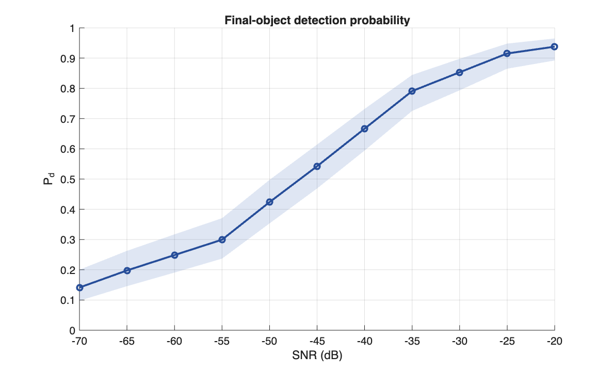
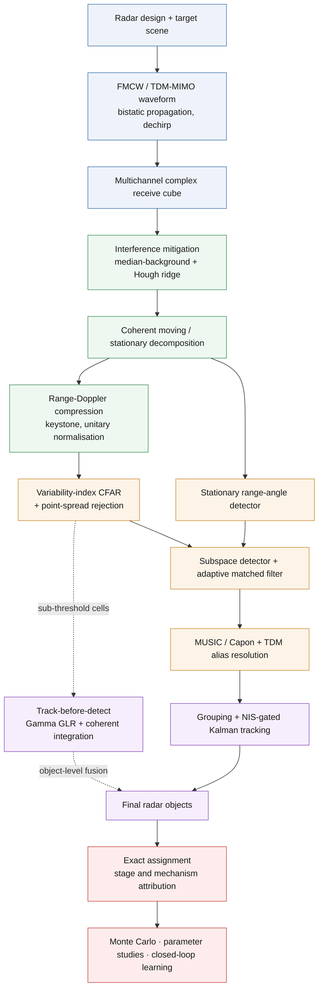

# FMCW / TDM-MIMO Automotive Radar — Simulation & Perception Framework

A 77 GHz automotive radar in MATLAB, from the transmitted chirp to the tracked object: coupled waveform design, bistatic multichannel propagation, interference mitigation, Gamma-calibrated CFAR detection, subspace angle estimation on a TDM virtual aperture, dual-branch track-before-detect, Kalman tracking with evidence-graded object formation, and a Monte Carlo campaign engine that attributes every miss and every false object to the stage that produced it.

> Full design documentation, derivations and complete results: **[TECHNICAL.md](TECHNICAL.md)**

---

## Measured performance — Monte Carlo campaign

275 held-out trials across 11 signal-to-noise conditions, randomised scenes, seeds paired across conditions:

| SNR (dB) | `Pd` | 95 % Wilson CI | False objects / frame | Range RMSE (m) | Angle RMSE (°) |
|---:|---:|---|---:|---:|---:|
| −70 | 0.141 | [0.098, 0.200] | 0.010 | 0.088 | 0.200 |
| −55 | 0.299 | [0.237, 0.371] | 0.040 | 0.086 | 0.187 |
| −45 | 0.542 | [0.469, 0.614] | 0.090 | 0.091 | 0.178 |
| −35 | 0.791 | [0.725, 0.844] | 0.110 | 0.090 | 0.188 |
| −25 | 0.915 | [0.865, 0.948] | 0.150 | 0.094 | 0.118 |
| −20 | 0.938 | [0.892, 0.965] | 0.140 | 0.094 | 0.098 |

Range accuracy holds between **0.086 m and 0.095 m** across the whole 50 dB span — under a fifth of the 0.500 m range cell — because sub-bin parabolic refinement rather than signal level sets the limit once a target is detected.

Loss attribution moves with the operating point: at −70 dB, **82 % of missed targets never produced energy above the local background**, so the loss is noise-limited. By −20 dB that fraction falls to 45 % and **55 % of misses sit at the grouping-to-object transition**, where the loss is accumulated evidence rather than available signal.



---

## The workbench — one interface for the whole radar

Everything above was produced by the same pipeline that runs under an interactive application. **The radar is not fixed in a script.** Carrier, maximum range, range and velocity resolution, bandwidth, chirp slope and duration, ADC rate, samples per chirp, frame length, azimuth span, transmit and receive counts — all editable live, with unit selectors, individual lock controls, and a derived-quantity panel that recomputes maximum beat frequency, ADC Nyquist requirement, range capability and TDM ambiguity as you type, refusing a physically impossible design before a run rather than after it.


*Design panel: scene table, waveform and array parameters, derived physical checks, six tuning tabs. Output panel: truth-versus-radar comparison, range-angle and range-velocity displays, bird's-eye object map, per-stage timing and detection attribution.*

**Build the scene target by target.** Range, velocity, cross-section and azimuth are editable per object; targets can be added, removed, or drawn fresh at random with a separation guard. A quarter of a random scene is static, so the stationary branch is exercised alongside the moving one.

**Reach every threshold in the chain.** Six tuning tabs expose the parameters the pipeline actually reads — not a curated subset:

| Tab | What it opens up |
|---|---|
| **CFAR** | Detector mode, false-alarm probability, training and guard geometry, weak-candidate floor, point-spread rejection |
| **Verification** | Matched-filter threshold and its false-alarm probability, subspace detector gates, angle search resolution |
| **AoA / TDM** | MUSIC grid density, prominence floor, model order, maximum sources, TDM alias span, coherence weighting |
| **TBD** | Path-quality gates for both weak-target branches — promotion score, support fraction, evidence floors |
| **Track / Object** | Association gate sigmas, confirmation window and hits, all four object-promotion routes |
| **Filtering** | Clutter method, coherent subtraction, Hough interference parameters |

Every control binds to a parameter the pipeline reads, and each opens on the value the model will actually use — so a set produced by closed-loop tuning appears in the interface after a restart, rather than living only in a file.

**See every stage, not just the answer.** Nine result views turn a run into a diagnosis:

| View | What it shows |
|---|---|
| **Truth vs Radar** | Per-object range, velocity and angle error against truth, with linked range-angle and range-velocity plots |
| **Metrics** | Detection probability and RMSE, scored through the same evaluator the offline campaign uses |
| **Detection Heat Map** | The moving-target CFAR map for the frame, with detections overlaid |
| **Paper Detection** | Moving and stationary maps side by side, showing what the coherent decomposition separated |
| **BEV Map** | Bird's-eye object map — the perception output as a driver-assistance stack would consume it |
| **RX / ADC** | The actual simulated dechirped waveform and its beat spectrum, straight off the receive chain |
| **Diagnostics** | Per-stage timing across acquisition, preprocessing, detection and tracking, with frame-history stepping |
| **Detection Diagnostics** | Pick a truth target and see which stage lost it, or pick a false object and see where it was born |
| **Performance** | Simulated frame period against wall-clock time — the real-time factor |

**Calibrate by measurement rather than guesswork.** Change a threshold, run, and read the attribution: the Detection Diagnostics view names the stage that discarded a target, and false objects are classified by mechanism — a target reported twice needs wider fusion gates, an invention needs a tighter stage. Frame history steps backward and forward through stored frames, redrawing every view from the stored snapshot, so a marginal frame can be examined after the fact instead of being chased live.

The same configuration objects drive the batch path, so anything found here transfers directly to a campaign.

---

## Architecture



Truth enters once, after object formation, inside the evaluation layer.

---

## Contents

- [Operating point](#operating-point)
- [Techniques](#techniques)
- [Running it](#running-it)
- [Results and outputs](#results-and-outputs)
- [Repository](#repository)
- [References](#references)

---

## Operating point

Four design choices — carrier, range resolution, velocity design point, velocity resolution — determine everything else through coupled radar relationships.

| Quantity | Value | Origin |
|---|---|---|
| Carrier / wavelength | 77 GHz / 3.893 mm | design input |
| Sweep bandwidth | 299.79 MHz | `B = c / 2ΔR` |
| Chirp duration / slope | 16.223 µs / 18.48 THz·s⁻¹ | `T = λ / 4·v_max`, `S = B / T` |
| Fast × slow time | 2048 × 128 | ADC floor, `λ / 2ΔvT` |
| Range / velocity resolution | 0.500 m / 0.9375 m·s⁻¹ | `c / 2B`, `λ / 2·Nd·T` |
| Unambiguous velocity | ±60 m·s⁻¹ chirp-to-chirp, ±30 m·s⁻¹ same-TX | narrows by `n_tx` |
| Array | 2 TX × 4 RX → 8-element virtual aperture, 3.50 λ | physical phase centres |
| Angular resolution | 14.50° half-power beamwidth | `0.886·λ / L` |
| Receiver noise | −88.3 dBm per chain | `kTBF`, band-limited to the IF passband |
| Coherent processing gain | +56.7 dB | `Nr·Nd`, four chains, window loss |

---

## Techniques

| Stage | Methods |
|---|---|
| **Waveform and propagation** | Coupled FMCW design from four inputs; bistatic per-element path lengths with first-order intra-chirp delay rate; TDM transmit scheduling; band-limited `kTBF` noise shaped to the IF passband; Swerling-0/I fluctuation; diffuse clutter; swept mutual FMCW interference with a physical direction of arrival |
| **Interference mitigation** | STFT median-background masking with ridge-continuity gating; power-weighted Hough line detection with a horizontal exclusion protecting constant-tone target beats; noise-floor fill on reconstruction |
| **Range-Doppler** | Single unitary normalisation authority shared by every transform; keystone range-migration correction with Lanczos-windowed sinc resampling; coherent per-transmit-branch moving/stationary decomposition |
| **Detection** | CA/OS/GO/SO-CFAR multipliers solved from the exact Gamma false-alarm integral; two-dimensional variability-index reference selection on summed-area tables; point-spread rejection against the window's 31.5 dB sidelobe ratio; Doppler edge guard; independently calibrated stationary detector |
| **Verification** | Adaptive matched filter with diagonal loading, thresholded at `−ln Pfa`; rank-one Sherman–Morrison subspace detector for co-channel interference |
| **Angle and ambiguity** | MUSIC with MDL model-order selection, forward-backward averaging and a Capon cross-check; TDM virtual aperture de-rotated per chirp; alias resolution scored on spectral prominence and slow-time coherence |
| **Weak targets** | Swerling-I generalised-likelihood-ratio dynamic-programming search with a constant-velocity line-fit gate; motion-compensated coherent integration thresholded by the inverse incomplete Gamma function |
| **Tracking** | Constant-velocity Kalman on the radial pair; chi-squared NIS association gating; separate circular Kalman recursion for bearing; four evidence-graded promotion routes; duplicate suppression sized to the beamwidth |
| **Evaluation** | Cardinality-first assignment by shortest augmenting path; per-stage miss attribution; per-mechanism false-object classification (splitting versus invention) |
| **Statistics** | Wilson score intervals for proportions; percentile bootstrap for continuous metrics; Clopper–Pearson exact intervals in the false-alarm study; common-random-number seed pairing; disjoint train/validation/test splits |

---

## Running it

MATLAB R2019b or later, base installation, no toolbox dependency.

```matlab
addpath(genpath(pwd));
run_all_selftests();          % nine behavioural and structural suites
```

**A single run**

```matlab
result = run_radar_project();
result = run_radar_project( ...
    struct('cfar', struct('Pfa', 1e-6), 'n_tx', 3), ...
    struct('Nframes', 32, 'snr_override', -40, 'show_figures', false));
```

Returns objects, tracker state, diagnostics, truth, the evaluation record with stage attribution, and the frame set.

**Interactive**

```matlab
fmcw_radar_gui();             % design and diagnostics workbench
run_radar_realtime();         % causal frame-by-frame under live control
```

**Experiments**

```matlab
run_parameter_studies('mode','sensitivity','trials',3);   % what is worth tuning
run_feedback_parameter_learning('mode','zero_false','iterations',12);
run_radar_benchmarks('suite','snr','trials',10,'frames',12);
run_publication_campaign('profile','quick');              % time this, then scale
```

**A sectioned campaign**, resumable between sections — each call appends to one store and the summary recomputes over everything gathered:

```matlab
for s = -70:5:-20
    run_radar_publication_monte_carlo('split','test','snr_values',s, ...
        'trials',25,'frames',8,'run_label',sprintf('snr%d',s));
end
T = readtable('docs/results/publication_monte_carlo/campaign_test_summary.csv');
```

Cost scales linearly with total frames. Time one trial before committing to a long run.

---

## Results and outputs

Campaign output lands in `docs/results/publication_monte_carlo/`:

| File | Contents |
|---|---|
| `campaign_<split>_store.mat` | every trial from every section, survives a restart |
| `campaign_<split>_trials.csv` | per-trial rows tagged with the run label |
| `campaign_<split>_summary.csv` | pooled summary with Wilson and bootstrap intervals |
| `test_miss_attribution.png` | where targets are lost, as a fraction, against SNR |
| `test_false_attribution.png` | where false objects originate, against SNR |
| plus Pd, RMSE, continuity and real-time-factor curves | |

Closed-loop tuning writes `docs/results/feedback_learning/` and persists the winning parameter set to `core/config/learned_defaults.mat`, which later runs and the interface adopt automatically beneath explicit caller overrides.

The two attribution figures are the ones to read first: a detection-probability curve says performance moved, and these say which stage moved it.

---

## Repository

| Path | Contents |
|---|---|
| `core/config` | The single definition of the radar, plus fail-fast validation |
| `core/simulation` | TDM-MIMO receive cube and the FMCW waveform primitive |
| `core/processing` | Normalisation authority, range-Doppler chain, keystone, moving/stationary decomposition, clutter filtering |
| `core/interference` | Median-background and Hough time-frequency mitigation |
| `core/detection` | Calibrated CFAR, matched filter, subspace detector, stationary detector, quality scoring |
| `core/estimation` | MUSIC and Capon, virtual-aperture formation, alias resolution, bearing fusion |
| `core/tbd` | Likelihood-ratio and coherent weak-target integration |
| `core/tracking` | Grouping, association, tracking, object existence, weak-target fusion |
| `core/evaluation` | Exact assignment scoring, stage and mechanism attribution |
| `experiments` | Monte Carlo engine, benchmarks, parameter studies, closed-loop learner, campaign wrappers |
| `validation` | Nine self-test suites plus the empirical false-alarm study |
| `gui` | Interactive design and diagnostics application |
| `docs` | Campaign output, learning trace, figures, screenshots |

Entry points sit at the root: `run_radar_project` for the offline pipeline with evaluation, `run_radar_realtime` for causal frame-by-frame operation.

---

## References

Foundational references for the techniques implemented here, not all individually cited in-code.

- **Rohling, H.**, "Radar CFAR Thresholding in Clutter and Multiple Target Situations," *IEEE Trans. Aerospace and Electronic Systems*, 1983 — order-statistic CFAR.
- **Robey, F. C., Fuhrmann, D. R., Kelly, E. J., Nitzberg, R.**, "A CFAR Adaptive Matched Filter Detector," *IEEE Trans. AES*, 1992 — adaptive matched filtering.
- **Schmidt, R. O.**, "Multiple Emitter Location and Signal Parameter Estimation," *IEEE Trans. Antennas and Propagation*, 1986 — MUSIC.
- **Capon, J.**, "High-Resolution Frequency-Wavenumber Spectrum Analysis," *Proceedings of the IEEE*, 1969 — Capon/MVDR beamforming.
- **Wax, M., Kailath, T.**, "Detection of Signals by Information Theoretic Criteria," *IEEE Trans. ASSP*, 1985 — MDL model-order selection.
- **Perry, R. P., DiPietro, R. C., Fante, R. L.** — Keystone transform formulation for range-migration correction across a coherent processing interval.
- **Barniv, Y.**, "Dynamic Programming Solution for Detecting Dim Moving Targets," *IEEE Trans. AES*, 1985 — dynamic-programming track-before-detect.
- **Blackman, S., Popoli, R.**, *Design and Analysis of Modern Tracking Systems*, Artech House, 1999 — gating, M/N confirmation, and track-management logic.
- **Clopper, C. J., Pearson, E. S.**, "The Use of Confidence or Fiducial Limits Illustrated in the Case of the Binomial," *Biometrika*, 1934 — the exact binomial confidence interval used throughout the benchmarking layer.
- **Skolnik, M.**, *Introduction to Radar Systems* — general FMCW and radar-system fundamentals.
- **Richards, M. A.**, *Fundamentals of Radar Signal Processing* — CFAR family and matched-filter detection theory.
- **Smith, M. E., Varshney, P. K.** — variability-index CFAR, the basis of the reference-selection scheme.
- **Hyun, E., Jin, Y., Lee, J.**, 2017 — the coherent moving/stationary decomposition structure.
- **Jonker, R., Volgenant, A.** — the shortest-augmenting-path assignment solver used by the evaluator.

**Background material:**
📺 **[Radar signal processing — FMCW, MIMO and detection theory](https://www.youtube.com/results?search_query=radar+signal+processing+fmcw+mimo+detection+course)**
